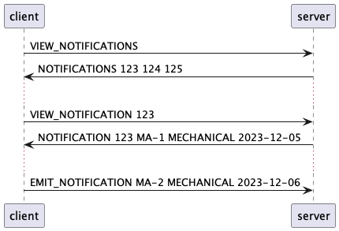
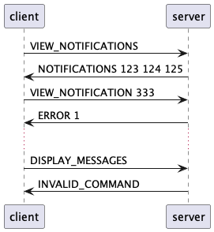

# Évaluation

Cette évaluation porte sur les notions suivantes:

- Définir un protocol applicatif
- Docker et Docker Compose
- Programmation UDP avec Java

Vous pouvez répondre aux questions en français ou en anglais.

Ressources autorisées :

- Une feuille de résumé (recto) papier avec vos propres notes

Toute tentative de tricherie sera sanctionnée avec la note 1.

## Partie théorique (43 points)

### Question 1 (25 minutes - 17 points)

Vous travaillez pour une entreprise spécialisée dans les machines industrielles
connectées au réseau. L'entreprise a décidé de créer un nouveau service pour
l'entretien des machines.

Le service permet aux machines d'émettre des notifications en cas de problèmes
techniques à un récepteur principal. Les personnes qui gèrent les machines
peuvent connaître l'état des machines en tout temps.

Une machine émet une notification lorsqu'elle rencontre un problème technique.
La notification contient le nom de la machine, le type de problème et la date à
laquelle le problème est survenu.

Le type de problème peut être l'un des suivants :

- `MECHANICAL`: problème mécanique
- `ELECTRICAL`: problème électrique

Le récepteur principal reçoit les notifications et stocke les informations dans
une structure de données avec un ID. Les personnes qui gèrent les machines
peuvent se connecter au récepteur pour consulter les notifications dans une
simple liste de toutes les notifications reçues ou pour consulter une
notification spécifique en utilisant l'ID.

Vous devez définir un protocole applicatif pour ce nouveau service.

Définissez le protocole applicatif selon la structure qui a été vue dans le
cours. Dans le contexte de ce test, deux exemples sont attendus (un fonctionnel
et un qui engendre une erreur) uniquement.

<details>
<summary>Afficher la réponse</summary>

# Protocole Mechanotify

## Section 1 - Aperçu (1 point)

Le protocole Mechanotify est un protocole applicatif qui permet à une machine
industrielle de notifier ses dysfonctionnements techniques envers un récepteur
principal. Les personnes qui gèrent les machines peuvent également récupérer
l'état des machines en tout temps.

## Section 2 - Protocole de transport (5 points)

Le récepteur s'exécute sur l'adresse multicast 239.0.0.1 sur le port 6343 et
utilise le protocole UDP pour recevoir les notifications. Il s'exécute aussi sur
le port 6344 pour recevoir les requêtes des personnes qui gèrent les machines en
unicast en utilisant le protocole de transport UDP (1 point pour la mention
du/des protocole(s), 1 point pour la mention du/des port(s)).

UDP est adapté car il permet de recevoir des messages sans connexion préalable
et si un message est perdu, une nouvelle notification future sera envoyée à
nouveau (0.5 point pour la justification du/des protocole(s)).

La connexion initiale doit se faire par le client lors de l'unicast (0.5 point).

Une fois la connexion établie, le client peut envoyer une commande au serveur.

Si la commande est valide, le serveur exécute la commande et envoie une réponse
au client. Si la commande n'est pas valide, le serveur envoie un message
d'erreur au client (1 point pour la gestion des commandes valides/invalides).

Le client peut décider de couper la connexion à tout moment. Ceci engendre la
fermeture de la connexion côté serveur de façon automatique (1 point pour la
gestion de la fermeture de la connexion).

## Section 3 - Messages (9 points)

Les messages envoyés par les machines et les personnes qui gèrent les machines
sont des messages textes (0.5 point) encodés en UTF-8 (0.5 point).

### Messages émis par les machines

Les messages émis par les machines sont sous la forme suivante :

#### Notifier un problème technique

##### Message (1 point)

```text
EMIT_NOTIFICATION machine_name issue_type issue_date
```

- `machine_name`: le nom de la machine
- `issue_type`: le type de problème technique
  - `MECHANICAL`: problème mécanique
  - `ELECTRICAL`: problème électrique
- `issue_date`: la date à laquelle le problème est survenu

##### Réponse (1 points)

- Il n'y a pas de réponse comme il s'agit d'une notification via multicast.

### Messages émis par les personnes qui gèrent les machines

Les messages émis par les personnes qui gèrent les machines sont sous la forme
suivante :

#### Visualiser les notifications

##### Message (1 point)

```text
VIEW_NOTIFICATIONS
```

##### Réponse (1 points)

- `NOTIFICATIONS <notification_id_1> <notification_id_2> <notification_id_3> ...`:
  la liste des notifications par leur ID. Les notifications sont séparées par
  des espaces.
- `ERROR <code>`: une erreur est survenue lors de la visualisation des
  notifications. Le code d'erreur est un entier entre 1 et 1 inclus. Les codes
  d'erreur sont les suivants :
  - 1: aucune notification n'a été reçue

### Visualiser une notification

#### Message (1 point)

```text
VIEW_NOTIFICATION notification_id
```

- `notification_id`: l'ID de la notification à visualiser

#### Réponse (1 points)

- `NOTIFICATION <notification_id> <machine_name> <issue_type> <issue_date>`: les
  les informations du produit
- `ERROR <code>`: une erreur est survenue lors de la visualisation du produit.
  Le code d'erreur est un entier entre 1 et 1 inclus. Les codes d'erreur sont
  les suivants :
  - 1: la notification demandée n'existe pas

### Commande invalide

#### Message (1 point)

```text
INVALID_COMMAND
```

#### Réponse (1 point)

- `INVALID_COMMAND`: la commande est invalide

### Section 4 - Exemples (2 points)

Voici des diagrammes PlantUML pour illustrer les exemples de messages.

#### Émettre une notification



#### Visualiser les notifications


#### Visualiser une notification


#### Commande invalide


Voici des diagrammes PlantUML pour illustrer les exemples de messages lorsque
des erreurs surviennent.

#### Visualiser les notifications



#### Visualiser une notification


</details>

### Question 2 (3 minutes - 3 points)

Affirmations sur UDP, vrai au faux ?

- UDP est un protocole dit "fiable" car il garantit la livraison des données
- UDP ne prend en charge la transmission de données qu'en unicast
- Il n'est pas nécessaire que la communication soit établie pour envoyer un
  message en broadcast ou en multicast
- UDP permet de découvrir des services sur un réseau
- Lors d'un broadcast, uniquement certains clients dits intéressés reçoivent le
  message. Les autres clients ne reçoivent pas le message.
- UDP ne fonctionne pas avec des streams mais avec des datagrams

<details>
<summary>Afficher la réponse</summary>

- Faux
- Faux
- Vrai
- Vrai
- Faux
- Vrai

</details>

### Question 3 (10 minutes - 8 points)

Votre équipe travaille sur une application réseau Java toute simple : elle
envoie un message "Hello, world!" lorsqu'un client se connecte en TCP à l'aide
de Telnet.

La commande `--help` retourne le message d'aide suivant :

```text
Usage: hello-world-1.0-SNAPSHOT.jar [-h] [COMMAND]
  -h, --help      Show this help message and exit.
Commands:
  start           Start the application on port 5000.
```

Votre tâche est de "containerizer" cette application réseau à l'aide de Docker
et Docker Compose.

Une personne avec qui vous travaillez a déjà créé un fichier `Dockerfile` et un
fichier `docker-compose.yml` pour vous aider dans cette tâche mais elle ne
comprend pas pourquoi l'application ne fonctionne pas correctement.

Fichier `Dockerfile` :

```dockerfile
WORKDIR /app

COPY ./hello-world-1.0-SNAPSHOT.jar /app/hello-1.0-SNAPSHOT.jar

EXPOSE 5000

ENTRYPOINT ["java", "hello-world-1.0-SNAPSHOT.jar"]

CMD ["help"]
```

Fichier `docker-compose.yml` :

```yaml
services:
  hello-world:
    image: ghcr.io/heig-vd-dai-course/hello-world
    build:
      context: ..
      dockerfile: Dockerfile
    command:
      - --help
    ports:
      - 5000:5001
```

Les trois fichiers (`Dockerfile`, `docker-compose.yml` et
`hello-world-1.0-SNAPSHOT.jar`) sont tous situés dans le même dossier.

Trouvez les 7 erreurs en indiquant la/les ligne(s) concernées et donnez une
explication avec vos propres mots pour chaque erreur pour expliquer à votre
collègue pourquoi l'application ne fonctionne pas.

Aussi, votre container doit respecter les points suivants:

- Si le container est démarré sans argument, il doit afficher le message d'aide.
- Une autre application réseau s'exécute déjà sur le port 5000 de la machine
  hôte. Il s'agit donc de démarrer cette application réseau un autre port que le
  5000 et d'utiliser le port 5001 à la place.

<details>
<summary>Afficher la réponse</summary>

Fichier `Dockerfile` :

```dockerfile
# Aucune image de base n'était spécifiée (1 point)
FROM eclipse-temurin:17

WORKDIR /app

# Le fichier était copié avec un nom différent (1 point)
COPY hello-world-1.0-SNAPSHOT.jar /app/hello-world-1.0-SNAPSHOT.jar

# L'application s'exécute sur le port 5000 - cette valeur n'est ici qu'à titre
# informatif/à des fins de documentation et la changer ne change pas le port sur
# lequel l'application s'exécute. Il ne faut donc pas changer cette valeur (1 point bonus si non changé)
EXPOSE 5000

# Il manquait le flag -jar (1 point)
ENTRYPOINT ["java", "-jar", "hello-world-1.0-SNAPSHOT.jar"]

# La commande `help` n'existe pas, il s'agit bien de passer l'argument `--help` (1 point)
CMD ["--help"]
```

Fichier `docker-compose.yml` :

```yaml
services:
  hello-world:
    image: ghcr.io/heig-vd-dai-course/hello-world
    build:
      # Le context doit spécifier le dossier dans lequel se trouve le Dockerfile (1 point)
      context: .
      dockerfile: Dockerfile
    command:
      # La commande pour démarrer l'application est `start` (1 point)
      - start
    ports:
      # Le port 5001 de la machine hôte doit être mappé sur le port 5000 du conteneur (1 point)
      - 5001:5000
```

</details>

### Question 4 (10 minutes - 6 points)

Quels sont les deux modèles de messagerie en UDP et en quoi diffèrent-ils en
termes de style de communication et d'attentes ? Donnez un exemple **simple** de
scénario approprié pour chaque modèle de messagerie.

<details>
<summary>Afficher la réponse</summary>

- Fire and forget (1 point) : Le modèle Fire and forget est le modèle de
  messagerie le plus simple. Il s'agit d'une communication à sens unique. Cela
  signifie qu'un datagramme est envoyé d'un hôte à un autre hôte sans attendre
  de réponse. (1 point)

- Request-response (1 point) : Le modèle request-response est une communication
  bidirectionnelle. Cela signifie qu'un datagramme est envoyé d'un hôte à un
  autre hôte et que le destinataire envoie une réponse à l'expéditeur. (1 point)

Exemples :

- Fire and forget: un émetteur (capteur) envoie un message à un récepteur
  (station météorologique) (1 point)
- Request and response: un client se connecte à une station météorologique pour
  obtenir la température actuelle (1 point)

</details>

### Question 5 (8 minutes - 6 points)

Citez **en quelques mots** la différence entre multicast, broadcast et unicast
et donnez un exemple **simple** d'utilisation pour chacun de ces types de
communication.

<details>
<summary>Afficher la réponse</summary>

- Unicast: communication entre deux machines (1 point)
- Multicast: communication entre un groupe de machines (1 point)
- Broadcast: communication entre toutes les machines d'un réseau (1 point)

Exemples:

- Unicast: un client qui se connecte à un serveur (1 point)
- Multicast: un serveur qui envoie un message à un sous-ensemble de clients
  (groupe WhatsApp) (1 point)
- Broadcast: un serveur qui envoie un message à tous les clients (Recherche de
  serveur DHCP) (1 point)

</details>

### Question 6 (3 minutes - 3 points - 6 x 0.5 point)

Affirmations sur Docker et Docker Compose, vrai au faux ?

- Un conteneur Docker est une machine virtuelle légère qui fonctionne de manière
  isolée de l'environnement hôte.
- Les conteneurs Docker peuvent partager des volumes avec le système hôte.
- Un Dockerfile peut spécifier des services, des volumes et des réseaux pour une
  application multi-conteneurs.
- Une image Docker peut être partagée et réutilisée pour exécuter des
  applications sur différents systèmes.
- La containerisation résout le problème de la difficulté d'installation des
  logiciels en les distribuant sous forme d'images.
- Un conteneur Docker stocke de manière persistante ses données.

<details>
<summary>Afficher la réponse</summary>

- Cette question étant trop ambiguë, elle est annulée. Tous les points sont
  attribués.
- Vrai
- Faux
- Vrai
- Vrai
- Faux

</details>
