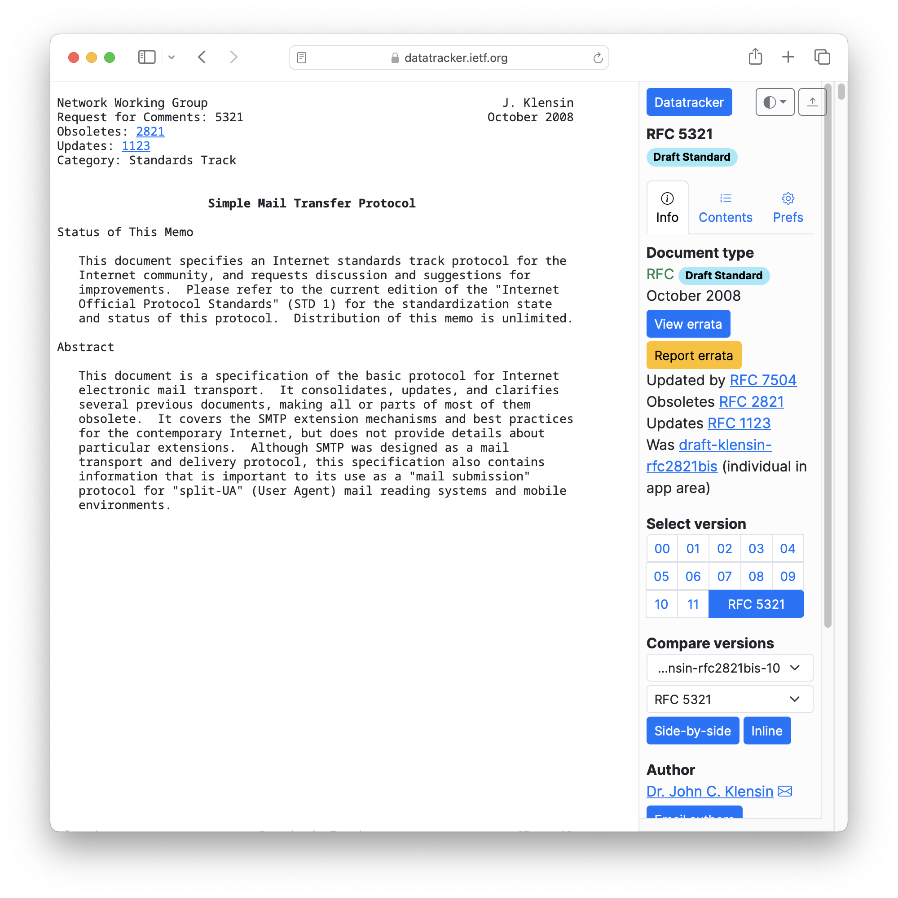
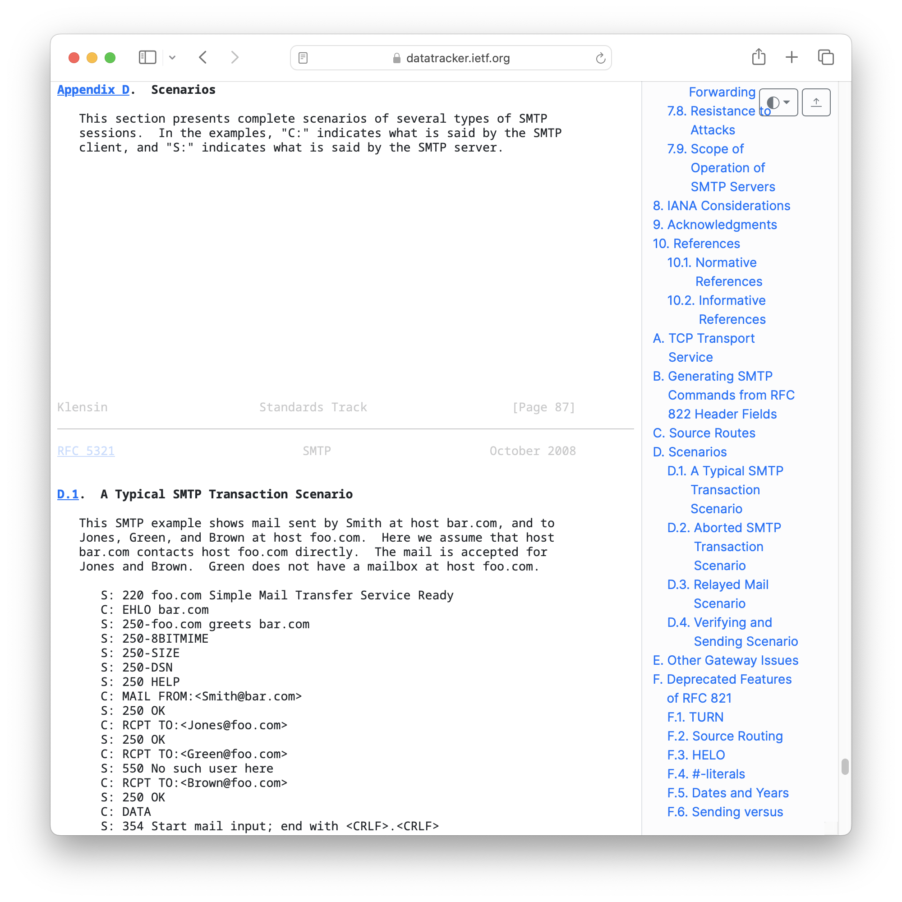

<!--
theme: gaia
size: 16:9
paginate: true
author: L. Delafontaine and H. Louis, with the help of ChatGPT
title: HEIG-VD DAI Course - Define an application protocol
description: Define an application protocol for the DAI course at HEIG-VD, Switzerland
url: https://heig-vd-dai-course.github.io/heig-vd-dai-course/09-define-an-application-protocol/
footer: '**HEIG-VD** - DAI Course 2023-2024 - CC BY-SA 4.0'
style: |
    :root {
        --color-background: #fff;
        --color-foreground: #333;
        --color-highlight: #f96;
        --color-dimmed: #888;
        --color-headings: #7d8ca3;
    }
    blockquote {
        font-style: italic;
    }
    table {
        width: 100%;
    }
    th:first-child {
        width: 15%;
    }
    h1, h2, h3, h4, h5, h6 {
        color: var(--color-headings);
    }
    h2, h3, h4, h5, h6 {
        font-size: 1.5rem;
    }
    h1 a:link, h2 a:link, h3 a:link, h4 a:link, h5 a:link, h6 a:link {
        text-decoration: none;
    }
    section:not([class=lead]) > p, blockquote {
        text-align: justify;
    }
headingDivider: 4
-->

[web]:
  https://heig-vd-dai-course.github.io/heig-vd-dai-course/09-define-an-application-protocol/
[pdf]:
  https://heig-vd-dai-course.github.io/heig-vd-dai-course/09-define-an-application-protocol/09-define-an-application-protocol-presentation.pdf
[license]:
  https://github.com/heig-vd-dai-course/heig-vd-dai-course/blob/main/LICENSE.md
[discussions]: https://github.com/orgs/heig-vd-dai-course/discussions
[illustration]:
  https://images.unsplash.com/photo-1521587760476-6c12a4b040da?fit=crop&h=720
[practical-content]:
  https://github.com/heig-vd-dai-course/heig-vd-dai-course/blob/main/09-define-an-application-protocol/COURSE_MATERIAL.md#practical-content
[practical-content-qr-code]:
  https://quickchart.io/qr?format=png&ecLevel=Q&size=400&margin=1&text=https://github.com/heig-vd-dai-course/heig-vd-dai-course/blob/main/09-define-an-application-protocol/COURSE_MATERIAL.md#practical-content

# Define an application protocol

<!--
_class: lead
_paginate: false
-->

<https://github.com/heig-vd-dai-course>

[Web][web] · [PDF][pdf]

<small>L. Delafontaine and H. Louis, with the help of ChatGPT</small>

<small>This work is licensed under the [CC BY-SA 4.0][license] license.</small>

![bg opacity:0.1][illustration]

## Objectives

- Learn where to find information about application protocols
- Understand application protocol
- Define application protocols
- How to use an application protocol

## What is an application protocol?

- Defines application communication
- RFCs on IETF
- Relies on transport and network protocols
- Multiple revisions exist

## How is structured an application protocol?

- Defined by rules
- Messages format
- Order of message exchange using state machine or sequence diagram(s)
- Edge and error cases

## How to define an application protocol?

- Define purpose of protocol
- Define messages/actions, their format and exchange order
- Define edge cases
- Be ready to change

## Reserved ports

- Ports identify processes or services
- Ports are 16-bit unsigned numbers
- Well-known ports: 0-1023
- Registered ports: 1024-49151
- Dynamic ports: 49152-65535

## A quick note on the Unix philosophy and POSIX

- Unix philosophy: minimalist, modular software
- POSIX defines APIs for portability on multiple operating systems

## Practical content

<!-- _class: lead -->

### What will you do?

- Explore existing application protocols
- Define your own application protocol based a use case

Understanding how an application protocol is defined will help you to understand
how to use them in future chapters!

### Find the practical content

<!-- _class: lead -->

You can find the practical content for this chapter on
[GitHub][practical-content].

[![bg right w:75%][practical-content-qr-code]][practical-content]

## Finished? Was it easy? Was it hard?

Can you let us know what was easy and what was difficult for you during this
chapter?

This will help us to improve the course and adapt the content to your needs. If
we notice some difficulties, we will come back to you to help you.

➡️ [GitHub Discussions][discussions]

You can use reactions to express your opinion on a comment!

## What will you do next?

In the next chapter, you will learn the following topics:

- Docker and Docker Compose

## Sources

- Main illustration by [Iñaki del Olmo](https://unsplash.com/@inakihxz) on
  [Unsplash](https://unsplash.com/photos/NIJuEQw0RKg)
- Illustration by [Aline de Nadai](https://unsplash.com/@alinedenadai) on
  [Unsplash](https://unsplash.com/photos/j6brni7fpvs)
- Illustration by [Henry Be](https://unsplash.com/@henry_be) on
  [Unsplash](https://unsplash.com/photos/lc7xcWebECc)
- Illustration by [CHUTTERSNAP](https://unsplash.com/@chuttersnap) on
  [Unsplash](https://unsplash.com/photos/xewrfLD8emE)
