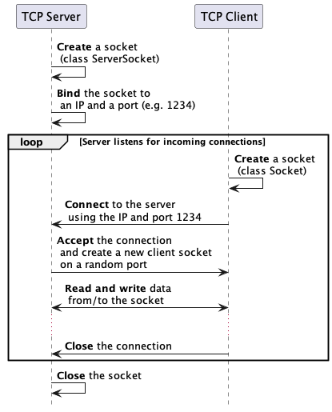
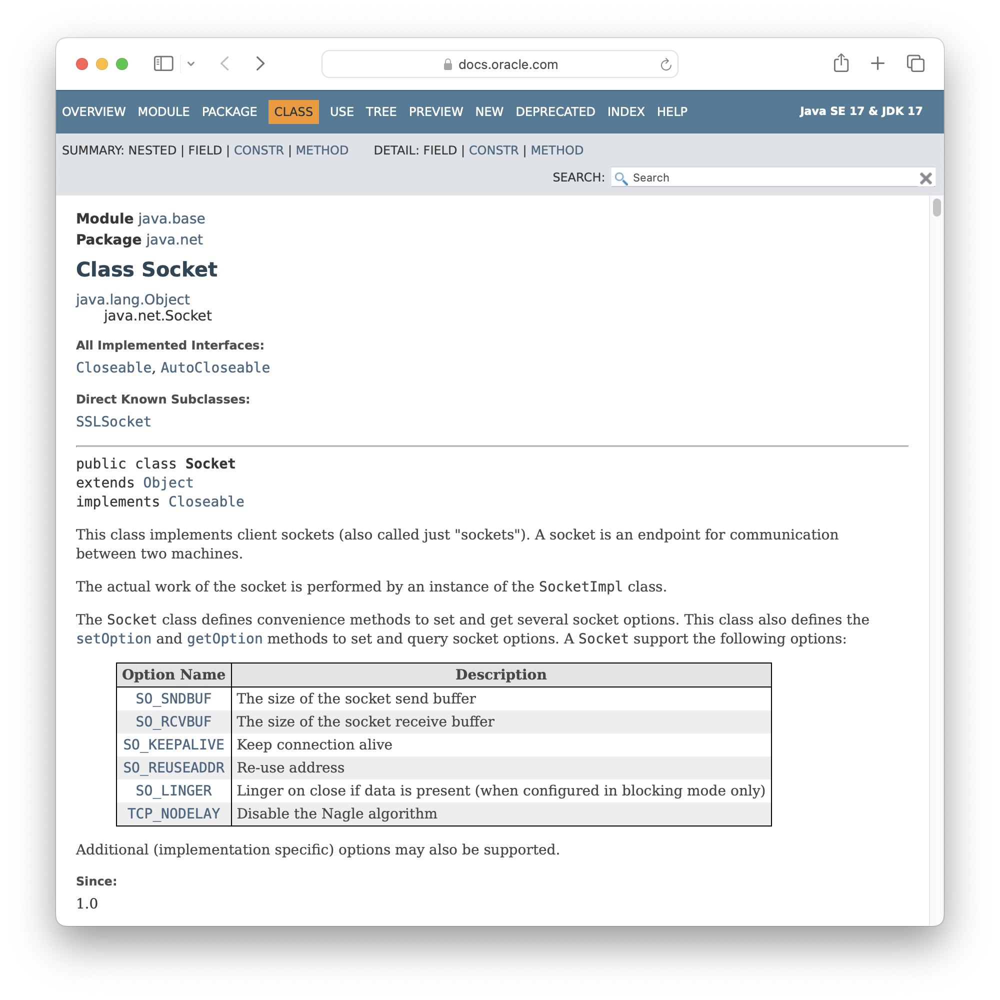

<!--
theme: gaia
size: 16:9
paginate: true
author: L. Delafontaine and H. Louis, with the help of GitHub Copilot
title: HEIG-VD DAI Course - Java TCP programming
description: Java TCP programming for the DAI course at HEIG-VD, Switzerland
url: https://heig-vd-dai-course.github.io/heig-vd-dai-course/12-java-tcp-programming/
footer: '**HEIG-VD** - DAI Course 2024-2025 - CC BY-SA 4.0'
style: |
    :root {
        --color-background: #fff;
        --color-foreground: #333;
        --color-highlight: #f96;
        --color-dimmed: #888;
        --color-headings: #7d8ca3;
    }
    blockquote {
        font-style: italic;
    }
    table {
        width: 100%;
    }
    th:first-child {
        width: 15%;
    }
    h1, h2, h3, h4, h5, h6 {
        color: var(--color-headings);
    }
    h2, h3, h4, h5, h6 {
        font-size: 1.5rem;
    }
    h1 a:link, h2 a:link, h3 a:link, h4 a:link, h5 a:link, h6 a:link {
        text-decoration: none;
    }
    section:not([class=lead]) > p, blockquote {
        text-align: justify;
    }
headingDivider: 4
-->

[web]:
  https://heig-vd-dai-course.github.io/heig-vd-dai-course/12-java-tcp-programming/
[pdf]:
  https://heig-vd-dai-course.github.io/heig-vd-dai-course/12-java-tcp-programming/12-java-tcp-programming-presentation.pdf
[license]:
  https://github.com/heig-vd-dai-course/heig-vd-dai-course/blob/main/LICENSE.md
[discussions]: https://github.com/orgs/heig-vd-dai-course/discussions/116
[illustration]: ./images/main-illustration.jpg
[course-material]:
  https://github.com/heig-vd-dai-course/heig-vd-dai-course/blob/main/12-java-tcp-programming/COURSE_MATERIAL.md
[course-material-qr-code]:
  https://quickchart.io/qr?format=png&ecLevel=Q&size=400&margin=1&text=https://github.com/heig-vd-dai-course/heig-vd-dai-course/blob/main/12-java-tcp-programming/COURSE_MATERIAL.md

# Java TCP programming

<!--
_class: lead
_paginate: false
-->

<https://github.com/heig-vd-dai-course>

[Web][web] · [PDF][pdf]

<small>L. Delafontaine and H. Louis, with the help of GitHub Copilot.</small>

<small>Based on the original course by O. Liechti and J. Ehrensberger.</small>

<small>This work is licensed under the [CC BY-SA 4.0][license] license.</small>

![bg opacity:0.1][illustration]

## Objectives

- Program your own TCP client/server applications in Java with the Socket API
- Understand how to process data from streams
- Make usage of a REPL

Your applications will be able to communicate over the network!


## TCP

<!-- _class: lead -->

More details for this section in the [course material][course-material]. You can
find other resources and alternatives as well.

### TCP

TCP is a transport protocol that is similar to a phone call:

1. A connection is established between two parties (Unicast)
2. Data sent is guaranteed to arrive in the same order
3. Data can be sent again if needed (retransmission)


## The Socket API

<!-- _class: lead -->

More details for this section in the [course material][course-material]. You can
find other resources and alternatives as well.

### The Socket API

- Originally developed by Berkeley University
- Ported to Java and many other languages
- Provides a simple API to use TCP and UDP
- A socket is a connection between two parties using a protocol and a port



---




### Client/server common functions

| Operation           | Description                        |
| ------------------- | ---------------------------------- |
| `socket()`          | Creates a new socket               |
| `getInputStream()`  | Gets the input stream of a socket  |
| `getOutputStream()` | Gets the output stream of a socket |
| `close()`           | Closes a socket                    |

### Client structure and functions

1. Create a `Socket`
2. Connect the socket to an IP address and a port number
3. Read and write data from/to the socket
4. Flush and close the socket

| Operation   | Description                                          |
| ----------- | ---------------------------------------------------- |
| `connect()` | Connects a socket to an IP address and a port number |

### Server structure and functions

1. Create a `ServerSocket`
2. Bind the socket to an IP address and a port number
3. Listen for incoming connections
4. Loop
   1. Accept an incoming connection - creates a new `Socket` on a port
   2. Read and write data from/to the socket
   3. Flush and close the socket
5. Close the `ServerSocket`

---

| Operation  | Description                                       |
| ---------- | ------------------------------------------------- |
| `bind()`   | Binds a socket to an IP address and a port number |
| `listen()` | Listens for incoming connections                  |
| `accept()` | Accepts an incoming connection                    |

To make it simple, a socket is just like a file that you can open, read from,
write to and close. To exchange data, sockets on both sides must be connected.

## Processing data from streams

<!-- _class: lead -->

More details for this section in the [course material][course-material]. You can
find other resources and alternatives as well.

### Processing data from streams

- Sockets use data streams to send and receive data, just like files
- Get an input stream to read data from a socket
- Get an output stream to write data to a socket


---

Get the streams from a socket:

```java
// Get input stream
input = socket.getInputStream();

// Get output stream
output = socket.getOutputStream();
```

Read and write data from/to the streams as text:

```java
// Get input stream as text
input = new InputStreamReader(socket.getInputStream(), StandardCharsets.UTF_8);

// Get output stream as text
output = new OutputStreamWriter(socket.getOutputStream(), StandardCharsets.UTF_8);
```

---

Improve performance with a buffer (with a binary stream):

```java
// Get input stream as binary with buffer
input = new BufferedReader(new InputStreamReader(socket.getInputStream());

// Get output stream as binary with buffer
output = new BufferedWriter(new OutputStreamWriter(socket.getOutputStream());
```

### Variable length data

Data sent can have a variable length. Manage this using one of the two methods:

- Use a delimiter
- Communicate a fixed length

This must be defined by your application protocol!


---

Using a delimiter:

```java
// End of transmission character
String EOT = "\u0004";

// Read data until the delimiter is found
String line;
while ((line = in.readLine()) != null && !line.equals(EOT)) {
  System.out.println(
    "[Server " + SERVER_ID + "] received data from client: " + line
  );
}
```

---

Communicating a fixed length:

```java
// Send the length of the data
out.write("DATA_LENGTH " + data.length() + "\n");

// Send the data
out.write(data);
```

```java
// Read the length of the data
String[] parts = in.readLine().split(" ");
int dataLength = Integer.parseInt(parts[1]);

// Read the data
for (int i = 0; i < dataLength; i++) {
  System.out.print((char) in.read());
}
```

## Read-Eval-Print Loop (REPL)

<!-- _class: lead -->

More details for this section in the [course material][course-material]. You can
find other resources and alternatives as well.

### Read-Eval-Print Loop (REPL)

A REPL is a concept that allows you to interact with a program by sending
commands to it without restarting it.

In networking, it is used to send commands to a server that will read the
commands, evaluate them, and send back the result.

All of this is done in a loop until the client or the server decides to close
the connection.

Useful to keep a connection open and send multiple commands!

## Questions

<!-- _class: lead -->

Do you have any questions?

## Practical content

<!-- _class: lead -->

### What will you do?

- Run full client/server examples
- Implement the _"Guess the number"_ game:
  - Using the application protocol you made in the previous chapter!
  - A template is here for you


### Find the practical content

<!-- _class: lead -->

You can find the practical content for this chapter on
[GitHub][course-material].

![bg right w:75%][course-material-qr-code]

## Finished? Was it easy? Was it hard?

Can you let us know what was easy and what was difficult for you during this
chapter?

This will help us to improve the course and adapt the content to your needs. If
we notice some difficulties, we will come back to you to help you.

➡️ [GitHub Discussions][discussions]

You can use reactions to express your opinion on a comment!

## What will you do next?

<!-- _class: lead -->

You will start the practical work!

## Sources

- Main illustration by [Carl Nenzen Loven](https://unsplash.com/@archduk3) on
  [Unsplash](https://unsplash.com/photos/N8GdKC4Rcvs)
- Illustration by [Aline de Nadai](https://unsplash.com/@alinedenadai) on
  [Unsplash](https://unsplash.com/photos/j6brni7fpvs)
- Illustration by [Alexander Andrews](https://unsplash.com/@alex_andrews) on
  [Unsplash](https://unsplash.com/photos/black-corded-telephone-JYGnB9gTCls)
- Illustration by [Oleksandra Bardash](https://unsplash.com/@bardashka) on
  [Unsplash](https://unsplash.com/photos/green-moss-on-rocky-river-9fqMbeny89c)
- Illustration by [patricia serna](https://unsplash.com/@sernarial) on
  [Unsplash](https://unsplash.com/photos/assorted-tape-measures-zPZ9vqqDNBA)
- Illustration by [Elliott Stallion](https://unsplash.com/@eagleboobs) on
  [Unsplash](https://unsplash.com/photos/white-plastic-bottle-on-brown-wooden-table-near-glass-window-ci7b3Q77n0c)
- Illustration by [K8](https://unsplash.com/@_k8_) on
  [Unsplash](https://unsplash.com/photos/people-in-restaurant-sWEpcc0Rm0U)
- Illustration by [bckfwd](https://unsplash.com/@bckfwd) on
  [Unsplash](https://unsplash.com/photos/lighted-chandelier-inside-cafe-ifkd981FUdM)

---

- Illustration by [James Elchico](https://unsplash.com/@jdelchico) on
  [Unsplash](https://unsplash.com/photos/blue-and-brown-padded-chairs-near-table-zB4A-PP49ww)
- Illustration by [micheile henderson](https://unsplash.com/@micheile) on
  [Unsplash](https://unsplash.com/photos/woman-selling-inside-store-during-daytime-7NFwwp-vZk8)
