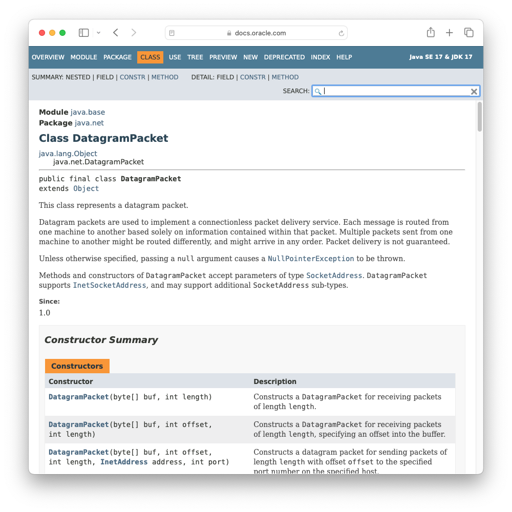
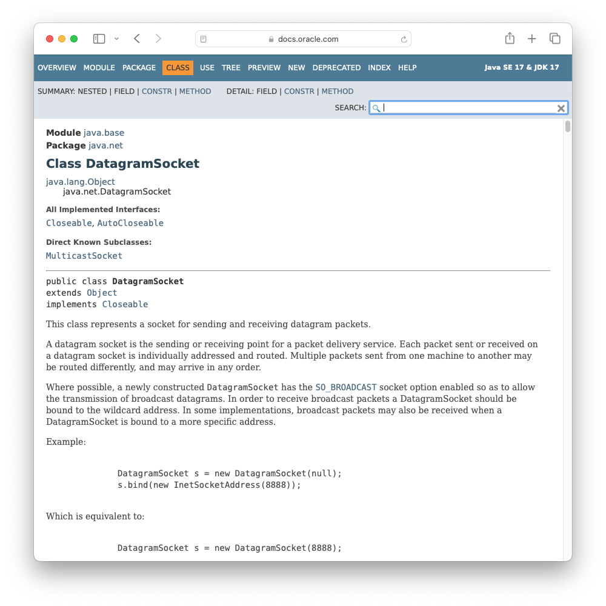

<!--
theme: gaia
size: 16:9
paginate: true
author: L. Delafontaine and H. Louis, with the help of GitHub Copilot
title: HEIG-VD DAI Course - Java UDP programming
description: Java UDP programming for the DAI course at HEIG-VD, Switzerland
url: https://heig-vd-dai-course.github.io/heig-vd-dai-course/13-java-udp-programming/
footer: '**HEIG-VD** - DAI Course 2024-2025 - CC BY-SA 4.0'
style: |
    :root {
        --color-background: #fff;
        --color-foreground: #333;
        --color-highlight: #f96;
        --color-dimmed: #888;
        --color-headings: #7d8ca3;
    }
    blockquote {
        font-style: italic;
    }
    table {
        width: 100%;
    }
    th:first-child {
        width: 50%;
    }
    h1, h2, h3, h4, h5, h6 {
        color: var(--color-headings);
    }
    h2, h3, h4, h5, h6 {
        font-size: 1.5rem;
    }
    h1 a:link, h2 a:link, h3 a:link, h4 a:link, h5 a:link, h6 a:link {
        text-decoration: none;
    }
    section:not([class=lead]) > p, blockquote {
        text-align: justify;
    }
headingDivider: 4
-->

[web]:
  https://heig-vd-dai-course.github.io/heig-vd-dai-course/13-java-udp-programming/
[pdf]:
  https://heig-vd-dai-course.github.io/heig-vd-dai-course/13-java-udp-programming/13-java-udp-programming-presentation.pdf
[license]:
  https://github.com/heig-vd-dai-course/heig-vd-dai-course/blob/main/LICENSE.md
[discussions]: https://github.com/orgs/heig-vd-dai-course/discussions/120
[illustration]:
  https://images.unsplash.com/photo-1578054041218-5ee0003926dd?fit=crop&h=720
[course-material]:
  https://github.com/heig-vd-dai-course/heig-vd-dai-course/blob/main/13-java-udp-programming/COURSE_MATERIAL.md
[course-material-qr-code]:
  https://quickchart.io/qr?format=png&ecLevel=Q&size=400&margin=1&text=https://github.com/heig-vd-dai-course/heig-vd-dai-course/blob/main/13-java-udp-programming/COURSE_MATERIAL.md

# Java UDP programming

<!--
_class: lead
_paginate: false
-->

<https://github.com/heig-vd-dai-course>

[Web][web] · [PDF][pdf]

<small>L. Delafontaine and H. Louis, with the help of GitHub Copilot.</small>

<small>Based on the original course by O. Liechti and J. Ehrensberger.</small>

<small>This work is licensed under the [CC BY-SA 4.0][license] license.</small>

![bg opacity:0.1][illustration]

## Objectives

- Learn the differences between TCP and UDP and reliability
- Learn what an UDP datagram is
- Learn the different ways to send a UDP datagram to one or multiple clients
- Learn UDP in the Socket API
- How UDP can be used for service discovery

## UDP

<!-- _class: lead -->

More details for this section in the [course material][course-material]. You can
find other resources and alternatives as well.

### UDP

- A transport layer protocol just like TCP
- Connectionless protocol - does not require to establish a connection before
  sending data
- Unreliable protocol - does not guarantee delivery but is fast
- Analogy: sending postcards through the postal service

## Differences between TCP and UDP

<!-- _class: lead -->

More details for this section in the [course material][course-material]. You can
find other resources and alternatives as well.

### Differences between TCP and UDP

- TCP
  - Connection-oriented
  - Reliable
  - Stream protocol
  - Unicast
  - Request-response
  - Used for FTP, HTTP, SMTP, SSH, etc.

---

- UDP
  - Connectionless
  - Unreliable
  - Datagram protocol
  - Unicast, broadcast and multicast
  - Fire-and-forget, request-response (manual)
  - Service discovery protocols
  - Used for DNS, streaming, gaming, etc.

## UDP datagrams

<!-- _class: lead -->

More details for this section in the [course material][course-material]. You can
find other resources and alternatives as well.

### UDP datagrams

- Datagrams = discrete chunks of data (packets) sent over the network
- Sent individually and independently
- Contain a header (source and destination ports, length, checksum, etc.) and a
  payload (data)

## Reliability

<!-- _class: lead -->

More details for this section in the [course material][course-material]. You can
find other resources and alternatives as well.

### Reliability

- UDP is unreliable (no guarantee of delivery, no guarantee of order)
- The application must implement its own reliability mechanism
- In some cases, reliability is not needed (e.g. streaming)
- Handling reliability is complex - not covered in this course

## UDP in the Socket API

<!-- _class: lead -->

More details for this section in the [course material][course-material]. You can
find other resources and alternatives as well.

### UDP in the Socket API

- `DatagramSocket` is used to send and receive datagrams
- A datagram is created with the `DatagramPacket` class
- A multicast socket is created with the `MulticastSocket` class.

## Unicast, broadcast and multicast

<!-- _class: lead -->

More details for this section in the [course material][course-material]. You can
find other resources and alternatives as well.

### Unicast, broadcast and multicast

- Unicast, broadcast and multicast are ways to send data over the network
- TCP is unicast only
- UDP can be unicast, broadcast or multicast

### Unicast

- One-to-one communication
- One sender and one receiver
- To send a datagram, the sender must know:
  - The IP address of the receiver
  - The port of the receiver

Think of it as a private conversation between two people

### Broadcast

- One-to-all communication
- One sender and multiple receivers
- To send a datagram, the sender must know:
  - The subnet
  - The port
- `255.255.255.255` for all hosts

Think of it as a public announcement.

### Multicast

- One-to-many communication
- One sender and some receivers
- To send a datagram, the sender must know:
  - The multicast address (between `239.0.0.0` and `239.255.255.255`)
  - The port

Think of it as a group conversation.

---

- Just as with broadcast, it can be blocked by routers
- Multicast is quite guaranteed **not** to work on the public Internet
- Made for the local network
- Multicast is a complex topic
- Not covered in depth in this course
- The course material contains some resources

## Messaging patterns

<!-- _class: lead -->

More details for this section in the [course material][course-material]. You can
find other resources and alternatives as well.

### Messaging patterns

- Fire-and-forget
  - One-way communication
  - No response
  - No guarantee of delivery
- Request-response
  - Two-way communication
  - Response
  - Guarantee of delivery (manual)

## Service discovery protocols

<!-- _class: lead -->

More details for this section in the [course material][course-material]. You can
find other resources and alternatives as well.

### Service discovery protocols

- Discover services on the network
- Two types of protocols
- Service discovery protocol patterns:
  - Advertisement (passive)
  - Query (active)

---

---

## Practical content

<!-- _class: lead -->

### What will you do?

- Run a complete emitter/receiver UDP example in Java
- Dockerize the emitter/receiver UDP example
- Isolate some containers in a dedicated Docker network

### Find the practical content

<!-- _class: lead -->

You can find the practical content for this chapter on
[GitHub][course-material].

![bg right w:75%][course-material-qr-code]

## Finished? Was it easy? Was it hard?

Can you let us know what was easy and what was difficult for you during this
chapter?

This will help us to improve the course and adapt the content to your needs. If
we notice some difficulties, we will come back to you to help you.

➡️ [GitHub Discussions][discussions]

You can use reactions to express your opinion on a comment!

## What will you do next?

<!-- _class: lead -->

You will start the practical work!

## Sources

- Main illustration by
  [Possessed Photography](https://unsplash.com/@possessedphotography) on
  [Unsplash](https://unsplash.com/photos/tiNCpHudGrw)
- Illustration by [Aline de Nadai](https://unsplash.com/@alinedenadai) on
  [Unsplash](https://unsplash.com/photos/j6brni7fpvs)
- Illustration by [Becky Phan](https://unsplash.com/@beckyphan) on
  [Unsplash](https://unsplash.com/photos/white-and-brown-wooden-photo-frame-qWsVgxgo1-E)
- Illustration by [Jackson Simmer](https://unsplash.com/@simmerdownjpg) on
  [Unsplash](https://unsplash.com/photos/blue-green-and-red-plastic-clothes-pin-Vqg809B-SrE)
- Illustration by [Sam Dan Truong](https://unsplash.com/@sam_truong) on
  [Unsplash](https://unsplash.com/photos/grey-metal-tower-during-daytime-ctngce7sr_Y)
- Illustration by [Zuza Gałczyńska](https://unsplash.com/@zgalczynska) on
  [Unsplash](https://unsplash.com/photos/group-of-people-watching-fireworks-display-c5_eQi4rrjA)
- Illustration by [Andy Holmes](https://unsplash.com/@andyjh07) on
  [Unsplash](https://unsplash.com/photos/milky-way-during-night-time-LUpDjlJv4_c)
