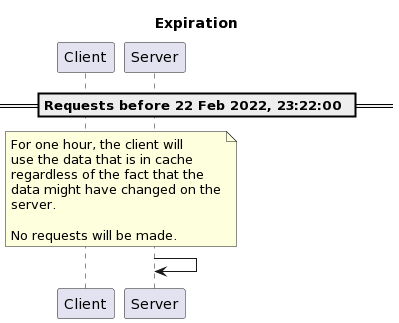
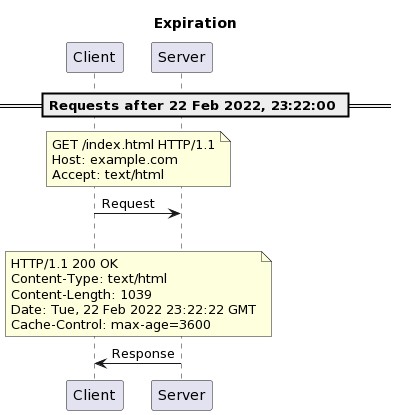
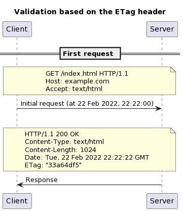
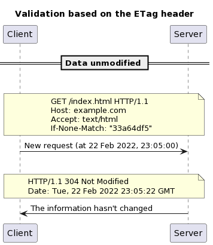
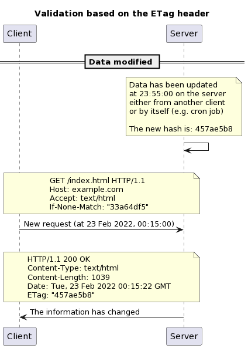
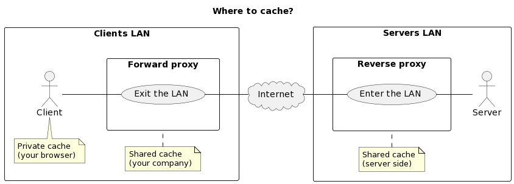
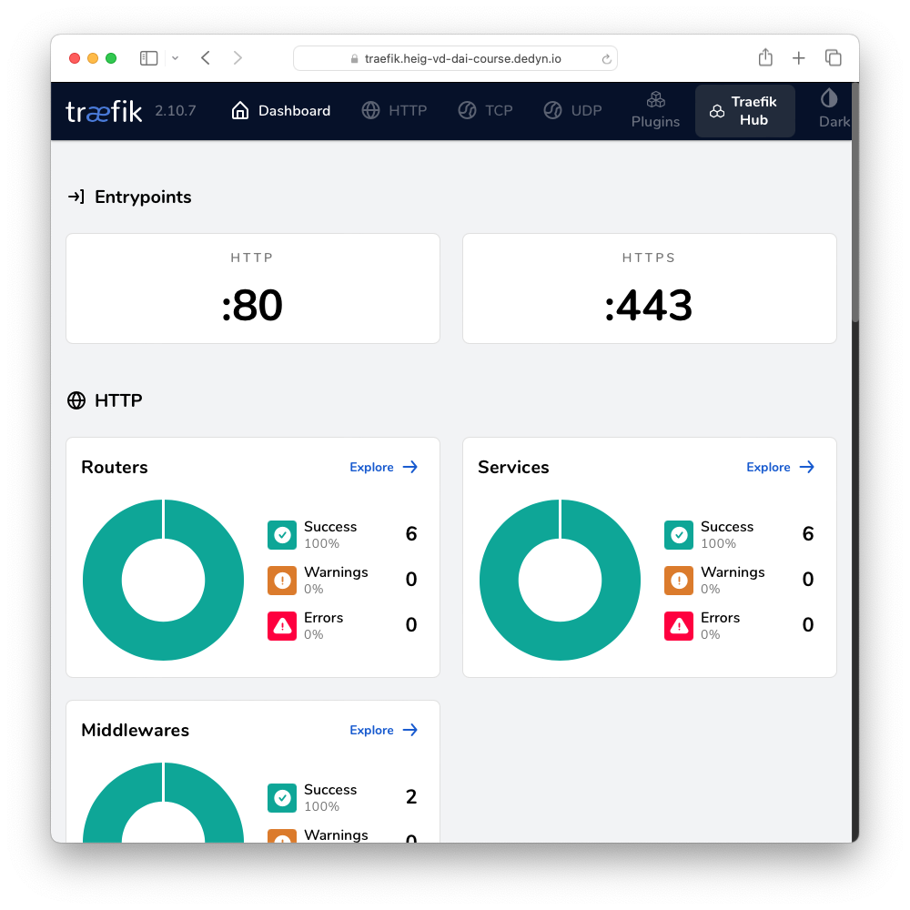

<!--
theme: gaia
size: 16:9
paginate: true
author: L. Delafontaine and H. Louis, with the help of GitHub Copilot
title: HEIG-VD DAI Course - Caching with Javalin
description: Caching with Javalin for the DAI course at HEIG-VD, Switzerland
url: https://heig-vd-dai-course.github.io/heig-vd-dai-course/23-caching-with-javalin/
footer: '**HEIG-VD** - DAI Course 2023-2024 - CC BY-SA 4.0'
style: |
    :root {
        --color-background: #fff;
        --color-foreground: #333;
        --color-highlight: #f96;
        --color-dimmed: #888;
        --color-headings: #7d8ca3;
    }
    blockquote {
        font-style: italic;
    }
    table {
        width: 100%;
    }
    th:first-child {
        width: 15%;
    }
    h1, h2, h3, h4, h5, h6 {
        color: var(--color-headings);
    }
    h2, h3, h4, h5, h6 {
        font-size: 1.5rem;
    }
    h1 a:link, h2 a:link, h3 a:link, h4 a:link, h5 a:link, h6 a:link {
        text-decoration: none;
    }
    section:not([class=lead]) > p, blockquote {
        text-align: justify;
    }
headingDivider: 4
-->

[web]:
  https://heig-vd-dai-course.github.io/heig-vd-dai-course/23-caching-with-javalin/
[pdf]:
  https://heig-vd-dai-course.github.io/heig-vd-dai-course/23-caching-with-javalin/23-caching-with-javalin-presentation.pdf
[license]:
  https://github.com/heig-vd-dai-course/heig-vd-dai-course/blob/main/LICENSE.md
[discussions]: https://github.com/orgs/heig-vd-dai-course/discussions/122
[illustration]:
  https://images.unsplash.com/photo-1492515114975-b062d1a270ae?fit=crop&h=720
[course-material]:
  https://github.com/heig-vd-dai-course/heig-vd-dai-course/blob/main/23-caching-with-javalin/COURSE_MATERIAL.md
[course-material-qr-code]:
  https://quickchart.io/qr?format=png&ecLevel=Q&size=400&margin=1&text=https://github.com/heig-vd-dai-course/heig-vd-dai-course/blob/main/23-caching-with-javalin/COURSE_MATERIAL.md

# Caching with Javalin

<!--
_class: lead
_paginate: false
-->

<https://github.com/heig-vd-dai-course>

[Web][web] · [PDF][pdf]

<small>L. Delafontaine and H. Louis, with the help of GitHub Copilot.</small>

<small>Based on the original course by O. Liechti and J. Ehrensberger.</small>

<small>This work is licensed under the [CC BY-SA 4.0][license] license.</small>

![bg opacity:0.1][illustration]

## Objectives

- Understand the concepts of Caching with Javalin
- Understand how HTTP features can help to build Caching with Javalin
- Understand the concepts of a reverse proxy
- Understand the concepts of load balancing
- Understand the concepts of caching

## Prepare and setup your environment

<!-- _class: lead -->

More details for this section in the
[course material](https://github.com/heig-vd-dai-course/heig-vd-dai-course/blob/main/23-caching-with-javalin/COURSE_MATERIAL.md#prepare-and-setup-your-environment).
You can find other resources and alternatives as well.

### Access your `hosts` file

File to map hostnames to IP addresses, just as DNS does, but only for your
computer.

- Windows:  
  `%WinDir%\System32\Drivers\Etc\Hosts`
- Linux and macOS:  
  `/etc/hosts`

### Traefik

- An open source reverse proxy (more on this later)
- Works well with Docker Compose and Kubernetes
- Issue and renew [Let's Encrypt](https://letsencrypt.org/) (HTTPS) certificates
  automatically
- Easy to use with
  [Docker Compose labels](https://docs.docker.com/compose/compose-file/compose-file-v3/#labels)

### whoami

- A tiny Go webserver that prints os information and HTTP request to output
- Used to demonstrate the use of HTTP with a reverse proxy and a load balancer

## Functional and non-functional requirements

<!-- _class: lead -->

More details for this section in the
[course material](https://github.com/heig-vd-dai-course/heig-vd-dai-course/blob/main/23-caching-with-javalin/COURSE_MATERIAL.md#functional-and-non-functional-requirements).
You can find other resources and alternatives as well.

### Functional and non-functional requirements

- Requirements used to **define the scope of a system**.
- An **abstract representation** of the system that will be implemented.
- Can help to **define the architecture of the system**.
- **Functional requirements**: features that a system must have to satisfy the
  needs of its users. It is the "what" of a system.
- **Non-functional requirements**: constraints on the system. It is the "how" of
  a system.

---

Examples of **functional requirements**:

- **User management**: Users must be able to register, login, logout, etc.
- **Product management**: Users must be able to create, read, update, delete
  products, etc.
- **Order management**: Users must be able to create, read, update, delete
  orders, etc.
- **Payment management**: Users must be able to pay for their orders, etc.

---

Examples of **non-functional requirements**:

- **Response time**: Time between a request and a response (end user)
- **Throughput**: Number of requests/interval (service provider)
- **Scalability**: Property of a system to handle a varying amount of work
- **Availability**: Percentage of time that the system provides a satisfactory
  service
- **Maintainability**: How easily the system can be managed
- **Security**: Confidentiality, authentication, authorization, etc.
- [...and many, many more](https://en.wikipedia.org/wiki/Non-functional_requirement)

## Web infrastructure definition

<!-- _class: lead -->

More details for this section in the
[course material](https://github.com/heig-vd-dai-course/heig-vd-dai-course/blob/main/23-caching-with-javalin/COURSE_MATERIAL.md#web-infrastructure-definition).
You can find other resources and alternatives as well.

### Web infrastructure definition

Software and hardware components that are necessary to support:

- the **development**
- the **deployment**
- the **management**

of web applications.

## The `Host` header

<!-- _class: lead -->

More details for this section in the
[course material](https://github.com/heig-vd-dai-course/heig-vd-dai-course/blob/main/23-caching-with-javalin/COURSE_MATERIAL.md#the-host-header).
You can find other resources and alternatives as well.

### The `Host` header

- Part of the HTTP request
- Used to specify the domain name of the server
- Can be used to **host multiple websites on the same server** using a reverse
  proxy
- The reverse proxy will **route the request to the correct website** based on
  the `Host` header

---

---

## Forward proxy and reverse proxy

<!-- _class: lead -->

More details for this section in the
[course material](https://github.com/heig-vd-dai-course/heig-vd-dai-course/blob/main/23-caching-with-javalin/COURSE_MATERIAL.md#forward-proxy-and-reverse-proxy).
You can find other resources and alternatives as well.

### Forward proxy and reverse proxy

- Proxies are components that **intercept** requests and responses and
  **filter/forward/change** them to another component.
- **Forward proxy**: used by a client to access external servers
- **Reverse proxy**: used by an external server to access internal servers

### Forward proxy

- Operates between clients and external systems
- Can be used to:
  - Restrict access to external systems
  - Regulate traffic
  - Mask the identity of the client
  - Enforce security policies

### Reverse proxy

- Operates between external systems and internal systems
- Can be used to:
  - Restrict access
  - Load balance requests to internal systems
  - Cache responses from internal systems

## System scalability

<!-- _class: lead -->

More details for this section in the
[course material](https://github.com/heig-vd-dai-course/heig-vd-dai-course/blob/main/23-caching-with-javalin/COURSE_MATERIAL.md#system-scalability).
You can find other resources and alternatives as well.

### System scalability

- Capacity of a system to handle a varying amount of work
- Can be achieved by:
  - Vertical scaling (scale up)
  - Horizontal scaling (scale out)
- Can be achieved by:
  - Adding more resources
  - Adding more servers

### Vertical scaling

Add more resources to a server:

- More RAM
- More CPU
- etc.

Limited by the hardware: at a certain point, you cannot add more/better
resources to a server.

### Horizontal scaling

Add more servers to a system and distribute the load between them.

Limited by the software - your software must be able to run on multiple servers:

- Backends/API accessing the same database(s)
- Frontends accessing backends/API

### When to use scale up or scale out?

- Determined by the **non-functional requirements** of the system
- You need metrics to determine when to scale up or scale out to identify
  bottlenecks
- Once the bottleneck is identified (from monitoring), you can decide to scale
  up or scale out

### How to monitor a system?

Out of scope for this course, but here are some tools you can use:

- [Prometheus](https://prometheus.io/)
- [Grafana](https://grafana.com/)
- [Sentry](https://sentry.io/)
- [LibreNMS](https://www.librenms.org/)

## Load balancing

<!-- _class: lead -->

More details for this section in the
[course material](https://github.com/heig-vd-dai-course/heig-vd-dai-course/blob/main/23-caching-with-javalin/COURSE_MATERIAL.md#load-balancing).
You can find other resources and alternatives as well.

### Load balancing

Process of **distributing the load** between multiple servers.

This can work thanks to the **stateless** nature of HTTP and the `Host` header.

The load balancer must know the **pool of servers** it can forward the requests
to.

---

Multiple strategies can be used to distribute the load:

- **Round-robin**: each server in the pool in turn (covered in this course)
- **Least connections**: least number of active connections
- **Least response time**: least response time
- **Hashing**: based on a hash of the request (e.g. the IP address of the
  client, the URL of the request, etc.)

---

An issue with load balancing is **session management**: the load balancer could
forward requests from the same client to different servers, loosing their
session.

As HTTP is stateless, the load balancer must know how to forward requests from
the same client to the same server. A solution is **sticky sessions** with the
help of a cookie.

## Caching

<!-- _class: lead -->

More details for this section in the
[course material](https://github.com/heig-vd-dai-course/heig-vd-dai-course/blob/main/23-caching-with-javalin/COURSE_MATERIAL.md#caching).
You can find other resources and alternatives as well.

### Caching

Process of **storing a copy of a resource to serve it faster**.

Caching can **improve the performance** of a system and **reduce the load** on
the backend.

Caching can be done on the **client-side** or **server-side**.

### Managing cache with HTTP

Managing chache is challenging because it is difficult to know when to
invalidate the cache (the data can be stale).

Two main caching models:

- **Expiration model**: the cache is valid for a certain amount of time
- **Validation model**: the cache is valid until the data is modified

#### Expiration model

- The cache is valid for a certain amount of time
- If the cache is not expired, the cache is used
- Uses the `Cache-Control: max-age=<secondes>` header
- The cache is invalidated after the expiration time

---

---

---

#### Validation model

- The cache is valid until the data is modified
- If the cache is not expired, the cache is used
- Two ways to validate the cache:
  - **Last-Modified**: `Last-Modified` and `If-Modified-Since` headers
  - **ETag**: `ETag` and `If-None-Match` headers

---

---

---

---

---

---

### CDN

Content Delivery Network (CDN) is a network of servers that are geographically
distributed around the world.

Improve performance by serving static content (images, videos, etc.) from the
closest server.

### Where to cache?

The best would be to cache at each level of the system to ensure the best
performance but it is not always possible or faisable:

- **Client-side**: the cache is stored on the client
- **Server-side**: the cache is stored on the server
- **CDN**: the cache is stored on a CDN

Private caches are caches that are only used by one client. Public caches are
caches that are used by multiple clients.

---

## Practical content

<!-- _class: lead -->

### What will you do?

- Set up a reverse proxy
- Set up whoami
- Explore the features of the reverse proxy:
  - `PathPrefix` rule
  - `Host` rule
  - `StripPrefix` middleware
  - Sticky sessions

### Find the practical content

<!-- _class: lead -->

You can find the practical content for this chapter on
[GitHub][course-material].

[![bg right w:75%][course-material-qr-code]][course-material]

## Finished? Was it easy? Was it hard?

Can you let us know what was easy and what was difficult for you during this
chapter?

This will help us to improve the course and adapt the content to your needs. If
we notice some difficulties, we will come back to you to help you.

➡️ [GitHub Discussions][discussions]

You can use reactions to express your opinion on a comment!

## What will you do next?

<!-- _class: lead -->

You will start the practical work!

## Sources

- Main illustration by [Nicolas Picard](https://unsplash.com/@artnok) on
  [Unsplash](https://unsplash.com/photos/-lp8sTmF9HA)
- Illustration by [Aline de Nadai](https://unsplash.com/@alinedenadai) on
  [Unsplash](https://unsplash.com/photos/j6brni7fpvs)
- Illustration by [Mohammadreza alidoos](https://unsplash.com/@mralidoost) on
  [Unsplash](https://unsplash.com/photos/black-and-silver-laptop-computer-0rUp9vgyEYo)
- Illustration by [Gaurav Dhwaj Khadka](https://unsplash.com/@gauravdhwajkhadka)
  on
  [Unsplash](https://unsplash.com/photos/brown-wooden-table-near-window-eRQ5Pk59p9s)
- Illustration by [Imre Tömösvári](https://unsplash.com/@timester12) on
  [Unsplash](https://unsplash.com/photos/gray-suv-on-road-during-daytime-FbhuN53_330)
- Illustration by [Kelvin T](https://unsplash.com/@gogofoto) on
  [Unsplash](https://unsplash.com/photos/blue-weighing-scale-at-0-FE_uysP-cfw)
- Illustration by [Alfred Kenneally](https://unsplash.com/@alken) on
  [Unsplash](https://unsplash.com/photos/black-beetle-on-green-grass-during-daytime-VrsNMCejQEw)
- Illustration by [Mikhail Vasilyev](https://unsplash.com/@miklevasilyev) on
  [Unsplash](https://unsplash.com/photos/colony-of-fire-ant-Vf1JrKMUS0Q)

---

- Illustration by [Ibrahim Boran](https://unsplash.com/@ibrahimboran) on
  [Unsplash](https://unsplash.com/photos/black-flat-screen-tv-turned-on-near-black-and-gray-audio-component-iYkqHp5cGQ4)
- Illustration by [Elena Mozhvilo](https://unsplash.com/@miracleday) on
  [Unsplash](https://unsplash.com/photos/person-sitting-on-chair-in-front-of-table-with-food-slaDjF7-HHQ)
- Illustration by [Evan Krause](https://unsplash.com/@evankrause_) on
  [Unsplash](https://unsplash.com/photos/assorted-box-lot-pdFMl6enmeo)
- Illustration by [Markus Spiske](https://unsplash.com/@markusspiske) on
  [Unsplash](https://unsplash.com/photos/a-toy-tractor-and-rocks-CBtiTnW_6Kk)
- Illustration by [Fermin Rodriguez Penelas](https://unsplash.com/@ferminrp) on
  [Unsplash](https://unsplash.com/photos/silhouette-of-mountain-near-body-of-water-during-daytime-6CQe-WYoPPk)
- Illustration by [Andrik Langfield](https://unsplash.com/@andriklangfield) on
  [Unsplash](https://unsplash.com/photos/pocket-watch-at-355-0rTCXZM7Xfo)
- Illustration by [Karen Grigorean](https://unsplash.com/@karengrigorean) on
  [Unsplash](https://unsplash.com/photos/a-person-pointing-at-a-large-display-of-pictures-9D6UlCW38Ss)
- Illustration by [Shubham's Web3](https://unsplash.com/@shubzweb3) on
  [Unsplash](https://unsplash.com/photos/an-abstract-background-of-orange-and-white-cubes-km9umcj61Ow)
